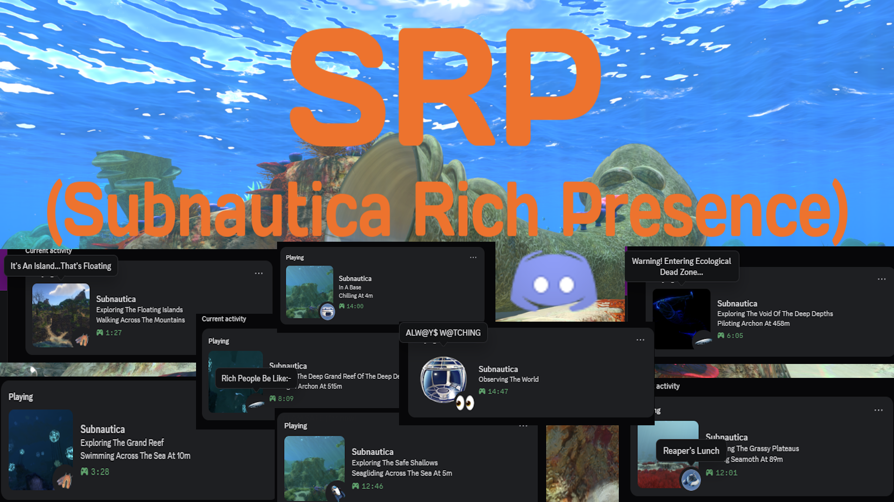

# SRP (Subnautica Rich Presence)

**A Rich Presence Integration Mod For Subnautica With Biome, Vehicle And Player State (Walking, Seagliding, Swimming Etc.) Support!**

## Features:-

- **Extensive Biomes Support:** Supports Almost All Main Biomes & Their Cave Variations With Images! (Thanks To The Subnautica Wiki).

- **Vehicle Support:** Supports All Vanilla + Some Modded Vehicles With Potential Support For More Modded Vehicles Soon.

- **Player State Support:** Supports Player States Like Swimming/Seagliding Or (If On Land) Walking/Running.

- **Configurable Update Timer:** Update Timer Is Configurable.

- **(Funny) Random Hover Texts:** Multiple & Randomized Image Hover Text On Discord For All Different Types Of Situations (Mostly Unfunny Because I Am Unfunny ;( Lol)

- **Customizable Hover Texts:** You Can Customize, Add Or Remove Hover Texts To Your Liking For Each Situation!

- **Mod Manager Support:** Supports Vortex Mod Manager (This ain't even a feature bro)

## Configuration Options:-

- **Enable SRP:** Enables Or Disables The Rich Presence
- **Enable Hover Text:** Enables Or Disables The Hover Text (In Case You Don't Like It)
- **EnableDeepDepths:** Enables Or Disables The `Of The Deep Depths` Suffix In Deep Biomes
- **RPC Update Interval:** Interval To Update RPC Every X Seconds (Default: 15 Seconds) [I DO NOT RECOMMENED ANYTING BELOW 15 AS DISCORD CAN RATE LIMIT IT AND IT MIGHT GET STUCK]
- ⚠️ **[DO NOT TOUCH] App ID:** Can Only Be Changed In The Config File, It Is Recommended To NOT TOUCH It As It WILL BREAK The Mod If You Do Not Have Assets For Each ID

## Installation:-

### Vortex (Recommended):-

1. Download Required Dependencies Using Their Installation Methods
2. Download This Mod Through The Files Tab Using **Mod Manager Download**
3. Enjoy!

### Manual:-

1. Download Required Dependencies Using Their Installation Methods
2. Download The Mod Archive From The Files Tab
3. Extract The Archive In Your Subnautica Game Folder
4. Enjoy!

## Editing Hover Texts:-

1. Go To Your `Subnautica/BepInEx/config/SubnauticaRP` Folder [If It's Not There, Run The Game Once]
2. Open The File Named `hoverTexts.json` Using Any Text Editor
3. It Should Be In This Format
```json
 {
    "Name": "lifepod", // Name Of The Situation
    "LargeImageText": [ // Large Image Text [If Applicable]
      "Fabricating Atomic Weapons", // List Of Texts, Add/Remove/Modify Texts Here
      "Why This Radio So Slow Bruhhhh",
      "So, Hypothecically, How Would I Make A Gun Mr. Fabricator?",
      "Glad I Didn't Fall In The Void"
    ],
    "SmallImageText": [ // Small (Bottom Right) Image Text [If Applicable]
      "A Knife And A Stasis Rifle Is All U Need",
      "I Don't Wanna Go Out There's Scary Fish :(",
      "Time To Conquer This Planet FR"
    ]
 }
```
4. Modify Or Add/Remove According To Your Liking, Make Sure Follow Json Rules So It Doesn't Crash
5. Save & Close The File
6. Make Sure To Restart Subnautica For Changes To Take Effect

**Note:** If You'd Like To Remove All The Text For Some Situation Then Simply Replace It With A `null` Like This:-
```json
 {
    "Name": "unkbiome",
    "LargeImageText": null
 }
```
**Note 2:** If You Do Edit The File, Make Sure To Have A Backup Of Your Edits Just In Case B/c The Code WILL Reset The File If The File Is Malformed.

**Note 3:** Updates May Or May Not Update The File Without Merging Changes (Untested) So Yeah Keep A Backup LOL

## Notes:-

- This Is My First Ever Mod So Sorry If It's A Lil Buggy Lol
- Please Report Any Bugs In The Notes/Bugs Tab
- If You'd Like Support For A Modded Vehicle/Biome, You Can Suggest It In The Notes Tab Or On My Discord
- If You'd Like To Contribute To The Mod Or If You Have Better Pictures For Certain Biomes Or More Fitting Hover Texts Then Feel Free To Suggest So On The Notes Tab Or On My Discord
- The Code Is Fully Open Source On My [Github](https://github.com/LabrynthKing/SubnauticaRP)
- My Discord Username Is `labrynthking`

## TODO:-

- Add Support For More Modded Vehicles (Need Permission From Original Devs Wherever Applicable)
- ~~Fix The Presence Getting Stuck Sometimes~~ [Discord's Fault Not Mine LOL]
- Add Support For Custom Biomes
- ~~Add Customizable Hover Texts~~
- ~~Potentially Add Support For Random/Multiple Hover Texts For Different Situations~~
- Maybe Add Support For Detection Of Big Mods Like TRP, The Prototype Expansion, Titan's Wall etc.

## Credits:-

- **[Subnautica Wiki](https://wiki.subnautica.com):** All Of The In-Game Images Have Been Sourced From The Wiki, And They Deserve All The Credit.
- **[AshenShade](https://www.nexusmods.com/profile/AshenShade):** For The [Archon](https://www.nexusmods.com/subnautica/mods/2509) & [Echelon](https://www.nexusmods.com/subnautica/mods/2153) Submarine Mods
- **[Mikjaw](https://www.nexusmods.com/profile/Mikjaw) & [Royalty](https://www.nexusmods.com/profile/XTXPRX):** For The [Blossom](https://www.nexusmods.com/subnautica/mods/1977) Submarine Mod
- **[Khaomi](https://github.com/Khaomi):** For Their [RichPresenceAPI](https://github.com/Khaomi/RichPresenceAPI)
- **[Lachee](https://github.com/Lachee):** For Their [discord-rpc-csharp](https://github.com/Lachee/discord-rpc-csharp) & [unity-named-pipes](https://github.com/Lachee/unity-named-pipes)
- **[The Nautilus Dev Team](https://www.nexusmods.com/subnautica/mods/1262):** For Their GREAT Library
- **[Tobey](https://www.nexusmods.com/profile/toebeann):** For Their [BepInEx Pack For Subnautica](https://www.nexusmods.com/subnautica/mods/1108) 